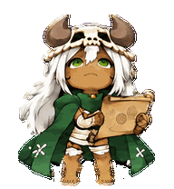

# silent pet

一个安静的 Codex v2 桌面宠物项目。当前角色名称为 **猎豹**：白发、骨角、绿披风，手持卷轴。

包含九组状态动画、16 个顺时针视线方向及独立默认姿势，重点改善动作循环、裁帧造成的尺寸跳动和方向切换。

<p>
  
  
</p>

## 安装

将仓库根目录的 `pet.json` 与 `spritesheet.webp` 放在同一个宠物目录中：

```text
~/.codex/pets/bone-horn-sorceress/
  pet.json
  spritesheet.webp
```

若配置了 `CODEX_HOME`，则使用该目录下的 `pets/bone-horn-sorceress/`。更新已有宠物前，请备份原目录。

项目名为 **silent pet**，宠物 ID 仍为 `bone-horn-sorceress`，显示名称仍为“猎豹”，便于替换现有宠物。

## 内容

```text
pet.json                  可安装的宠物配置
spritesheet.webp          完成验证的 v2 图集
atlas.json                图集布局及状态描述
previews/                 九组动作、方向循环和图集预览
source/rows/              选定的原始生成条带
source/reference.png      原角色身份参考
source/look-anchors.png   已批准的四主方向
source/layout-guides/     生成时使用的布局参考
prompts/                  图像生成提示词
production.json           源图与提示词映射
docs/                    制作说明与验收记录
```

## 动画布局

图集为 **1536 × 2288**，8 列 × 11 行，每格 **192 × 208**。`spriteVersionNumber` 为 `2`。

| 行 | 状态 | 动画帧数 |
|---|---|---:|
| 0 | idle：呼吸与眨眼 | 6 |
| 1 | running-right：向右移动 | 8 |
| 2 | running-left：向左移动 | 8 |
| 3 | waving：招手 | 4 |
| 4 | jumping：小跳 | 5 |
| 5 | failed：失落反应 | 8 |
| 6 | waiting：期待用户回应 | 6 |
| 7 | running：读卷轴、处理任务 | 6 |
| 8 | review：检查结果 | 6 |
| 9–10 | 视线方向 | 16 |

第 0 行第 6 列（从 0 开始计数）保存 v2 默认视线姿势。其他未使用格保持透明。

视线以屏幕正上方为 `000`，按每步 22.5° 顺时针排列；`090` 为右，`180` 为下，`270` 为左。默认姿势独立于 `000`。

[查看完整方向图](previews/look-directions.png) · [查看完整图集](previews/contact-sheet.png)

## 制作与验证

在现有角色参考上使用内置 `image_gen` 制作，随后完成确定性提取、共享缩放、图集合成与一次边缘去色。仓库保存选定源图及提示词，不包含生成服务凭据或原工作环境的本机路径。

- 图集尺寸、版本、有效格和透明区域检查通过。
- 清理过程保持 alpha 不变，安装图集哈希与验收版本一致。
- 三名隔离审查者完成随机 A/B 方向盲测，四主方向通过。
- 独立视觉审查检查了正常尺寸逐帧顺序与闭环；未宣称在桌面应用中实时播放验收。

完整记录见 [验收摘要](docs/artifact.json)、[最终视觉检查](docs/qa/final-visual-qa.json) 和 [制作说明](docs/production.md)。

## 已知轻微差异

- `157.5`、`202.5`、`225` 接近低头姿势时，左右提示较弱；盲测有分歧，但完整转头顺序没有明显反向或突跳。
- 左跑采用较短步态周期，小跳比待机略小。

这些差异保留在验收记录中，未隐藏或改写盲测原始投票。
